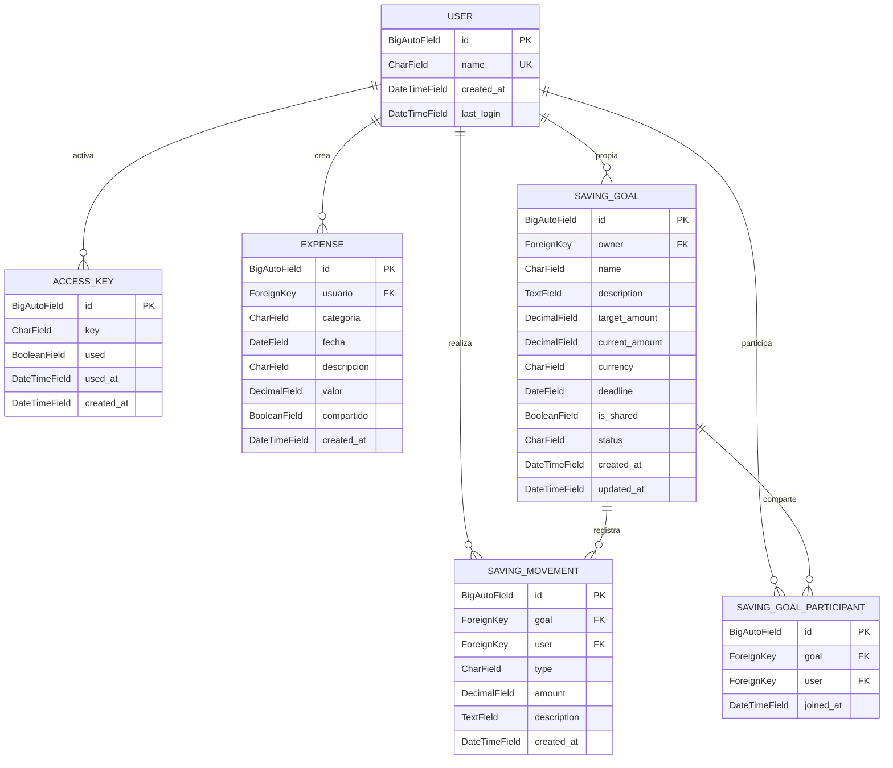

<p align="center">
  
  
  
  
  
  
</p>

<h1 align="center">Finanzas — API REST Backend</h1>

<p align="center">
  API REST para la gestión de finanzas personales.<br/>
  Autenticación JWT sin login tradicional — solo se accede mediante llaves de activación únicas.
</p>

<p align="center">
  <a href="#instalación-docker-recomendado">Docker</a> •
  <a href="#instalación-manual">Manual</a> •
  <a href="#endpoints-de-la-api">Endpoints</a> •
  <a href="#tests">Tests</a> •
  <a href="#decisiones-de-diseño">Decisiones</a>
</p>

---

## Características Principales

- **Autenticación sin login**: Los usuarios se activan con llaves únicas predefinidas. No hay formulario de registro ni contraseña.
- **JWT sin estado**: Tokens de acceso (60 min) y refresco (7 días). Sin sesiones en servidor.
- **Gastos compartidos**: Los gastos pueden ser privados o compartidos entre ambos usuarios.
- **Metas de ahorro**: Crear, depositar, retirar, compartir metas con historial completo de movimientos.
- **Permisos a nivel de objeto**: Cada usuario solo ve lo que le corresponde. Los recursos no autorizados retornan 404 (no 403).
- **120 tests automatizados**: Cobertura completa de los 3 módulos con pytest-django.
- **Dockerizado**: Dockerfile multi-stage + docker-compose para desarrollo y producción.

---

## Stack Tecnológico

| Componente | Tecnología | Versión |
|---|---|---|
| Lenguaje | Python | 3.11 |
| Framework | Django | 5.2.4 |
| API REST | Django REST Framework | 3.16.0 |
| Autenticación | djangorestframework-simplejwt | 5.5.0 |
| Variables de entorno | django-environ | 0.13.0 |
| Base de datos | PostgreSQL (Supabase) | 16 |
| Driver DB | psycopg2-binary | 2.9.10 |
| Servidor WSGI | Gunicorn | 23.0.0 |
| Testing | pytest-django | 4.11.1 |
| Contenedorización | Docker + Docker Compose | 24.x |

---

## Arquitectura del Proyecto

```
finanzas-backend/
├── config/                     # Configuración central de Django
│   ├── settings.py             # Config principal (DB, apps, JWT)
│   ├── urls.py                 # Enrutador principal
│   ├── wsgi.py                 # Punto de entrada WSGI
│   └── asgi.py                 # Punto de entrada ASGI
│
├── authentication/             # App: Autenticación y usuarios
│   ├── models.py               # User (custom) + AccessKey
│   ├── views.py                # ActivateKeyView
│   ├── serializers.py          # ActivateKeySerializer
│   ├── permissions.py          # IsAuthenticated
│   ├── urls.py                 # /api/activate-key/
│   └── migrations/
│
├── expenses/                   # App: Gastos personales
│   ├── models.py               # Expense
│   ├── views.py                # CRUD de gastos (sin DELETE)
│   ├── serializers.py          # ExpenseSerializer
│   ├── permissions.py          # IsOwner
│   ├── urls.py                 # /api/expenses/
│   └── migrations/
│
├── savings/                    # App: Metas de ahorro
│   ├── models.py               # SavingGoal, SavingMovement, SavingGoalParticipant
│   ├── views.py                # CRUD + depósitos/retiros/movimientos/participantes
│   ├── serializers.py          # SavingGoalSerializer, etc.
│   ├── permissions.py          # IsGoalOwner, IsGoalParticipant
│   ├── urls.py                 # /api/savings/
│   └── migrations/
│
├── tests/                      # Suite de tests (120 tests)
│   ├── test_authentication.py  # 15 tests
│   ├── test_expenses.py        # 37 tests
│   └── test_savings.py         # 68 tests
│
├── scripts/                    # Scripts SQL utilitarios
├── Dockerfile                  # Build multi-stage para producción
├── docker-compose.yml          # Desarrollo: Django + PostgreSQL local
├── docker-compose.prod.yml     # Producción: Django + Supabase
├── entrypoint.sh               # Script de inicio del contenedor
├── conftest.py                 # Fixtures compartidos de tests
├── pytest.ini                  # Configuración de pytest
├── requirements.txt            # Dependencias Python
└── .env.example                # Template de variables de entorno
```

---

## Diagrama de Entidades (ER)



---

## Instalación (Docker — Recomendado)

### Requisitos previos

- [Docker](https://docs.docker.com/get-docker/) v24.0+
- [Docker Compose](https://docs.docker.com/compose/install/) v2.20+

### 1. Clonar el repositorio

```bash
git clone https://github.com/tu-usuario/finanzas-backend.git
cd finanzas-backend
```

### 2. Configurar variables de entorno

```bash
cp .env.example .env
# Editar .env con tus credenciales
```

### 3. Levantar con Docker Compose (desarrollo)

```bash
docker compose up --build
```

El servidor estará disponible en `http://localhost:8000/`

### 4. Levantar en producción (Supabase)

```bash
# Editar .env apuntando a Supabase
docker compose -f docker-compose.prod.yml up --build -d
```

### Comandos útiles de Docker

```bash
# Ver logs en tiempo real
docker compose logs -f web

# Detener servicios
docker compose down

# Detener y eliminar volúmenes
docker compose down -v

# Ejecutar manage.py dentro del contenedor
docker compose exec web python manage.py migrate
docker compose exec web python manage.py createsuperuser
```

---

## Instalación Manual

### Requisitos previos

- Python 3.11 o superior
- pip
- PostgreSQL (local o en Supabase)

### 1. Clonar el repositorio

```bash
git clone https://github.com/tu-usuario/finanzas-backend.git
cd finanzas-backend
```

### 2. Crear entorno virtual

```bash
python -m venv venv

# Windows
venv\Scripts\activate

# Linux/Mac
source venv/bin/activate
```

### 3. Instalar dependencias

```bash
pip install -r requirements.txt
```

### 4. Configurar variables de entorno

```bash
cp .env.example .env
# Editar .env con tus credenciales de Supabase
```

### 5. Aplicar migraciones

```bash
python manage.py migrate
```

### 6. Crear llaves de acceso

Ejecutar el script SQL en Supabase SQL Editor:

```sql
-- scripts/create_keys.sql
INSERT INTO authentication_accesskey (key, used, used_at, created_at)
VALUES
  ('FINANZAS-2026-USUARIO-1', false, NULL, NOW()),
  ('FINANZAS-2026-USUARIO-2', false, NULL, NOW());
```

### 7. Ejecutar el servidor

```bash
python manage.py runserver
```

---

## Variables de Entorno

| Variable | Descripción | Ejemplo |
|---|---|---|
| `SECRET_KEY` | Clave secreta de Django | `django-insecure-abc123...` |
| `DEBUG` | Modo debug (`True`/`False`) | `True` |
| `ALLOWED_HOSTS` | Hosts permitidos (separados por coma) | `localhost,127.0.0.1` |
| `DB_NAME` | Nombre de la base de datos | `postgres` |
| `USER` | Usuario de PostgreSQL | `postgres.xxxxx` |
| `PASSWORD` | Contraseña de PostgreSQL | `tu-password` |
| `HOST` | Host de la base de datos | `aws-1-us-east-2.pooler.supabase.com` |
| `PORT` | Puerto de la base de datos | `6543` |
| `JWT_ACCESS_TOKEN_LIFETIME_MINUTES` | Tiempo de vida del access token | `60` |

---

## Endpoints de la API

**Base URL:** `http://127.0.0.1:8000/api/`

### Autenticación

| Método | Endpoint | Descripción | Auth |
|---|---|---|---|
| `POST` | `/api/activate-key/` | Activar llave y crear cuenta | No |
| `POST` | `/api/token/refresh/` | Renovar access token | No |

### Gastos

| Método | Endpoint | Descripción | Auth |
|---|---|---|---|
| `GET` | `/api/expenses/` | Listar gastos propios + compartidos | Si |
| `POST` | `/api/expenses/` | Crear gasto | Si |
| `GET` | `/api/expenses/{id}/` | Detalle de un gasto | Si |
| `PUT` | `/api/expenses/{id}/` | Actualizar gasto (solo dueño) | Si |

> **Nota:** DELETE no esta implementado en gastos (retorna 405).

### Ahorro

| Método | Endpoint | Descripción | Auth |
|---|---|---|---|
| `GET` | `/api/savings/goals/` | Listar metas propias + compartidas | Si |
| `POST` | `/api/savings/goals/` | Crear meta de ahorro | Si |
| `GET` | `/api/savings/goals/{id}/` | Detalle de una meta | Si |
| `PUT` | `/api/savings/goals/{id}/` | Actualizar meta (solo dueño) | Si |
| `DELETE` | `/api/savings/goals/{id}/` | Eliminar meta (solo dueño) | Si |
| `POST` | `/api/savings/goals/{id}/deposit/` | Registrar deposito | Si |
| `POST` | `/api/savings/goals/{id}/withdraw/` | Registrar retiro | Si |
| `GET` | `/api/savings/goals/{id}/movements/` | Historial de movimientos | Si |
| `POST` | `/api/savings/goals/{id}/participants/` | Agregar participante (solo dueño) | Si |

> Para documentacion detallada de cada endpoint (request/response bodies, errores), ver [DOC_API.md](DOC_API.md).

---

## Tests

### Ejecutar todos los tests

```bash
# Local
python -m pytest -v

# Docker
docker compose exec web python -m pytest -v
```

### Ejecutar tests de un modulo

```bash
python -m pytest tests/test_authentication.py -v
python -m pytest tests/test_expenses.py -v
python -m pytest tests/test_savings.py -v
```

### Cobertura

| Modulo | Tests | Estado |
|---|---|---|
| authentication | 15 | Todos pasando |
| expenses | 37 | Todos pasando |
| savings | 68 | Todos pasando |
| **Total** | **120** | **100% passing** |

---

## Decisiones de Diseno

### Por que no hay login tradicional?

El sistema esta disenado para exactamente **2 usuarios** que comparten gastos y metas de ahorro. No tiene sentido un formulario de registro abierto. En su lugar, las llaves de activacion (`FINANZAS-2026-USUARIO-1`, `FINANZAS-2026-USUARIO-2`) se insertan directamente en la base de datos. Una vez activada una llave, el usuario nunca necesita hacer login de nuevo — el JWT se renueva con el refresh token.

### Por que no hay DELETE en gastos?

Los gastos representan transacciones historicas. Eliminar un gasto distorsionaria los reportes financieros. En su lugar, los gastos pueden ser actualizados (por ejemplo, marcando un valor en 0 o cambiando la descripcion). Esto es una decision de negocio, no tecnica.

### Permisos a nivel de objeto

Los permisos van mas alla del `IsAuthenticated` global. Cada endpoint valida quien puede ver, editar o eliminar un recurso:

- **Gastos**: El dueño puede ver y editar. Otros usuarios solo ven los gastos marcados como compartidos.
- **Metas de ahorro**: El dueño tiene control total. Los participantes de metas compartidas pueden ver, depositar y retirar.
- **Recursos no autorizados**: Retornan **404** (no 403) para ocultar la existencia del recurso.

### Por que PostgreSQL y no SQLite?

Aunque SQLite funciona para desarrollo, PostgreSQL en Supabase ofrece:
- Soporte para transacciones ACID completas
- Pool de conexiones (Transaction Pooler)
- Backups automaticos
- Escalabilidad si el proyecto crece
- Compatibilidad con Docker ( PostgreSQL 16 Alpine en desarrollo local )

### Multi-stage Docker Build

El Dockerfile usa un build de dos etapas para optimizar el tamano de la imagen final:

1. **Stage 1 (deps)**: Instala todas las dependencias de Python
2. **Stage 2 (production)**: Copia solo las dependencias instaladas + el codigo

Esto reduce la imagen final de ~900MB a ~200MB. Ademas, el contenedor corre con un usuario no-root (`appuser`) por seguridad.

---

## Autor


- LinkedIn: [LinkedIn](https://www.linkedin.com/in/jean-paul-morales-altamirano-855583219/)


---
